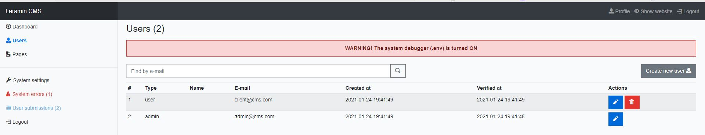

# Laramin CMS - simple MVP Content Management System based on Laravel framework

**Laramin CMS** is a MVP CMS (Content Management System) based on Laravel framework created for web developers to support them in creating web applications. This is a Laravel with `nwidart/laravel-modules`, auth, dashboard, user and pages management. Laramin CMS provides a basic functionality needed in every project so you don't start from the white space. It has: 
- Homepage, subpages, contact page, send contact
- Admin dashboard (to manage content, pages, menus, media, users, user submissions)
- SEO features: Headers, content, meta and Open Graph data, structured Schema.org data, titles and alts for images

Also it provides a few more tips like system settings, system errors, auth management, user module. 
I tried to create it as simple as it can be, using as less packages as possible (for maintenance reasons) - only MVP functions. So you can easily develop it and implement own stuff needed in your project. 

- [Modules](#laramin-cms-modules)
- [Used Packages and libraries](#used-packages-and-libraries)
- [Requirements](#requirements)
- [Installation](#installation)
- [Examples and demo](#examples-and-demo)
- [TODO list](#todo-list)
- [Model media base usage](#model-media-base-usage)
- [Licence](#Licence)

## Laramin CMS modules
 - Core (basic stuff here)
 - Dashboard
 - Page with media and thumbs
 - Media (minimal)
 - Menu (work in progress)
 - Blog (work in progress)

## Used packages and libraries
### Backend and PHP:
 - Laravel framework 8.26.1: `laravel/framework`. https://laravel.com/
 - Laravel modules: `nwidart/laravel-modules`. https://nwidart.com/laravel-modules/v6/introduction
 - Spatie medialibrary: `spatie/laravel-medialibrary`. https://spatie.be/docs/laravel-medialibrary/v9/introduction
### Frontend and JS:
 - laravel-mix
 - Bootstrap 4
 - jQuery
 - open-iconic
 - lightbox2
#### Dashboard additional packages
 - sweetalert2
 - tinymce

 ## Requirements
- PHP >= 7.3 or 8.0

## Installation
 * Clone this repo: `git clone`
 * Copy .env.example to .env file: `cp .env.example .env`
 * Install the composer vendors: `composer install`
 * Install NPM packages: `npm install`
 * Compile NPM packages: `npm run dev`
 * Create a new database (for example `laramin_cms_database`)
 * Edit .env file and complete config and DB connection data:
 ```
APP_URL=http://laramincms.local
APP_TIMEZONE=UTC
APP_LOCALE=en

DB_CONNECTION=mysql
DB_HOST=127.0.0.1
DB_PORT=3306
DB_DATABASE=laramin_cms_database
DB_USERNAME=root
DB_PASSWORD=
 ```
 * `php artisan key:generate`
 * Create new database, complete the .env file and migrate with seeders: `php artisan migrate --seed`
 * Run CMS: `php artisan serve` or create a vhost/domain


## Examples and demo
After migrate and seed there are 2 users created (admin and client):
```
Username: admin@cms.com
Password: Admin12345!

Username: client@cms.com
Password: Client12345!
```
Admin user has full access to dashboard





## TODO list
I'm going to develop this project. All TODOs and ideas will be in this section

* add mail config and test send mail
* TEST auth and send mails, reset, register...
* check all config files in config folder
* check/add media allowed extensions
* Add settings seeder with basic settings
* Test fresh installation

* Add `lian-yue/vue-upload-component` as image uploader
* Add `propaganistas/laravel-disposable-email` library
* Add Google reCaptcha v2/v3 to contact page
* Menu module
* Blog module
* Add AMP pages (dynamic)

## Model media base usage
There is `spatie/laravel-medialibrary` installed. More information here: https://spatie.be/docs/laravel-medialibrary/v9/introduction

If you are going to use Media - remember about PHP and MySQL variables:

```php
[PHP]
memory_limit
post_max_size
upload_max_filesize

[MySQL]
max_allowed_packet

[config/media-library.php]
'max_file_size' => 1024 * 1024 * 10 // 10MB
```

Register media for model (Page model example):
```php
    use Spatie\MediaLibrary\HasMedia;
    use Spatie\MediaLibrary\InteractsWithMedia;
    use Spatie\Image\Manipulations;
    ...

    class Page extends Model implements HasMedia
{
    use InteractsWithMedia;
    ...


    /**
     * Register all media for this model with features and conversions
     * (from Spatie\MediaLibrary\InteractsWithMedia trait)
     * 
     * @return void
     */
    public function registerMediaCollections(): void
    {
        $this->addMediaCollection('main')->singleFile();
        $this->addMediaCollection('gallery');

        $this->addMediaConversion('thumb')->width(600)->height(400)->fit(Manipulations::FIT_CROP, 600, 400);
    }

    /**
     * Custom method to get main image
     */
    public function getMainImage()
    {
        return $this->getMedia('main')->first();
    }
```

There are a lot of manipulations you can do with images. See Spatie\Image\Manipulations for details. Cool and useful effects: `sepia`, `pixelate(5)`, `greyscale()`, `fit`

Command: `php artisan media-library:regenerate` regenerates all media conversions

## Licence
MIT